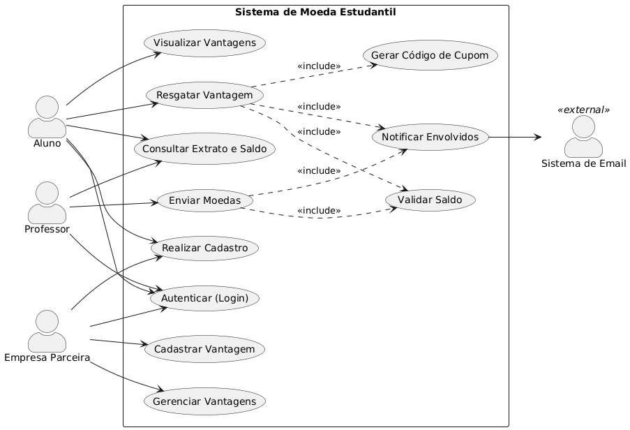
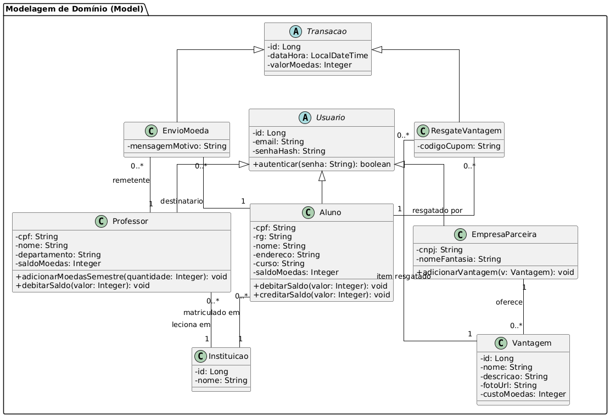

# 🏷️ Sistema de Aluguel de Carros 👨‍💻

O objetivo deste projeto consiste na construcao de um sistema para apoio a gestão de aluguéis de automoveis, permitindo efetuar, cancelar, consultar e modificar pedidos de aluguel pela Internet.

## 📝 Sobre o Projeto

O software propõe o desenvolvimento de um sistema web para controle e gestão de locação de automóveis, oferecendo aos clientes uma interface intuitiva para realizar, cancelar e modificar reservas de forma autônoma. A plataforma centraliza o gerenciamento da frota de veículos, o acompanhamento de contratos e o histórico de locações, garantindo maior eficiência operacional para a empresa e uma experiência ágil e acessível para o usuário final.

## Objetivo

Desenvolver um software em Java utilizando Micronaut, para gerenciar pedidos e contratos de aluguel de carros, incluindo analise financeira por agentes (empresas e bancos) e acompanhamento do ciclo completo do pedido.

## ✨ Funcionalidades Principais

- 🔐 **Autenticação Segura:** Login, Cadastro e Recuperação de Senha.
- 📈 **Gestão de Solicitações de Aluguel:** Criação, consulta, modificação e cancelamento de pedidos de aluguel..
- 📊 **Avaliação de Solicitações:** Análise financeira, modificação, aprovação/reprovação e execução de contratos por empresas e bancos.
- 👤 **Gestão de Contratantes:** Cadastro de dados pessoais (RG, CPF, Nome, Endereço), profissão, vínculos empregatícios e rendimentos (até 3 entidades).
- 🚗 **Gestão de Automóveis:** Cadastro de veículos com matrícula, ano, marca, modelo e placa, incluindo registro de propriedade conforme tipo de contrato.
- 📄 **Gestão de Contratos:** Criação e acompanhamento de contratos de aluguel, com suporte à associação de contratos de crédito concedidos por bancos agentes.

## Tecnologias Utilizadas

- **Java**: 21
- **Micronaut**: 4.x
- **Maven**: build e execucao do backend
- **React**: 19
- **React Router**: 7
- **Vite**: 7
- **Node.js + npm**: build e execucao do frontend

## Dependencias

- Backend: gerenciadas pelo `Maven` no arquivo `backend/pom.xml`
- Frontend: gerenciadas pelo `npm` no arquivo `frontend/package.json`

## 📂 Estrutura de Pastas

```
/
├── backend/                   # Backend Micronaut (Java)
│   ├── src/
│   │   ├── main/
│   │   │   ├── java/com/puc/aluguelcarros/
│   │   │   │   ├── configuration/  # Configurações do framework
│   │   │   │   ├── controller/     # Endpoints da API REST
│   │   │   │   ├── enums/          # Tipos enumerados
│   │   │   │   ├── facade/         # Fachadas para simplificação de lógica
│   │   │   │   ├── model/          # Entidades de domínio
│   │   │   │   ├── repository/     # Acesso a dados
│   │   │   │   ├── service/        # Lógica de negócio e serviços
│   │   │   │   └── Application.java # Ponto de entrada
│   │   │   └── resources/          # Configurações (application.yml)
│   └─  pom.xml                # Gerenciador de dependências Maven
├── frontend/                  # Frontend React Router (Vite)
│   ├── app/
│   │   ├── components/        # Componentes UI reutilizáveis
│   │   ├── routes/            # Definição de rotas e páginas
│   │   ├── services/          # Serviços de API e autenticação
│   │   ├── welcome/           # Componentes de boas-vindas
│   │   ├── app.css            # Estilos globais
│   │   ├── root.tsx           # Layout principal da aplicação
│   │   └── routes.ts          # Configuração de rotas
│   ├── public/                # Ativos estáticos (imagens, ícones)
│   ├── package.json           # Dependências e scripts npm
│   ├── tailwind.config.js     # Configuração do Tailwind CSS
│   └── vite.config.ts         # Configuração do Vite
├── docs/                      # Documentação UML, diagramas e identidade visual
└── README.md                  # Documentação principal do projeto
```

## 🎨 Identidade Visual

Para o desenvolvimento da interface, foi utilizada a paleta de cores:

- **Color Hunt Palette**: [303841, 3a4750, f6c90e, eeeeee](https://colorhunt.co/palette/3038413a4750f6c90eeeeeee)


## Instalacao e Execucao

### Pre-requisitos

- Java 21
- Maven
- Node.js 18+ e npm

### Passos

1. Inicie o backend a partir da raiz do repositorio:

   ```bash
   mvn -f backend/pom.xml mn:run
   ```

2. Em outro terminal, inicie o frontend:

   ```bash
   cd frontend
   npm install
   npm run dev
   ```

3. Acesse a aplicacao no navegador:

   - Frontend: http://localhost:5173
   - Backend: http://localhost:8080

## Modelos UML

### Diagrama de Casos de Uso



### Diagrama de Classes e Pacotes



### Diagrama de Componentes


## Integrantes

[](https://github.com/henriquegdc)

[](https://github.com/joaopedromourinhasantos)

[](https://github.com/Miguelgdn1)

## Professor Responsavel

[](https://github.com/joaopauloaramuni)


## Licenca

Definir a licenca oficial do projeto.
